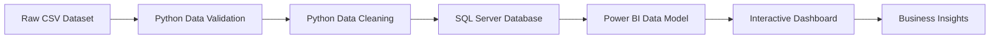
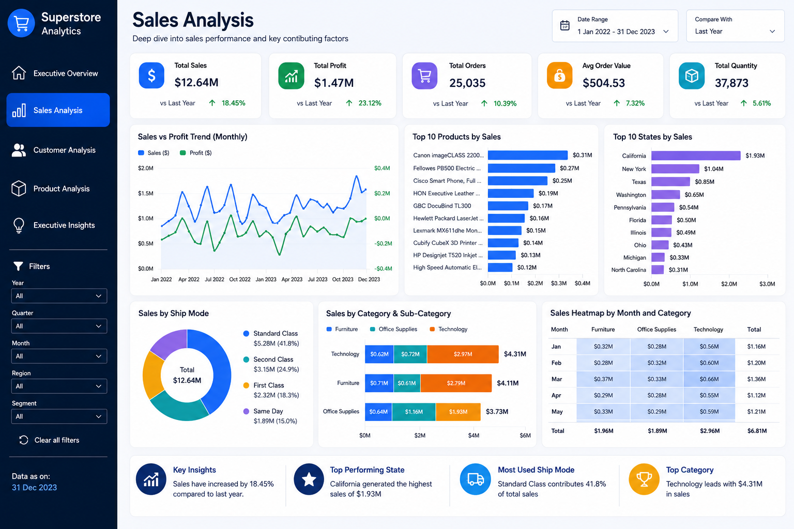
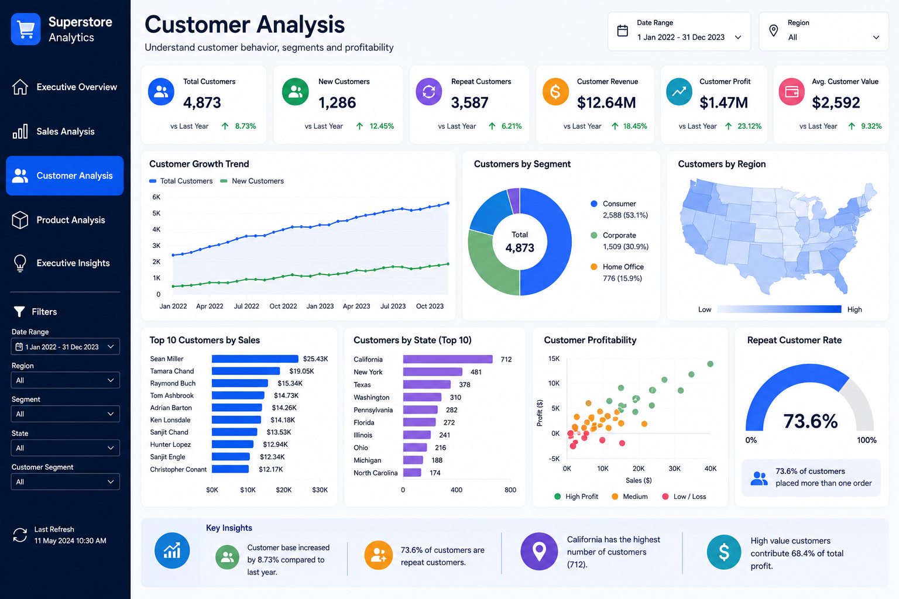
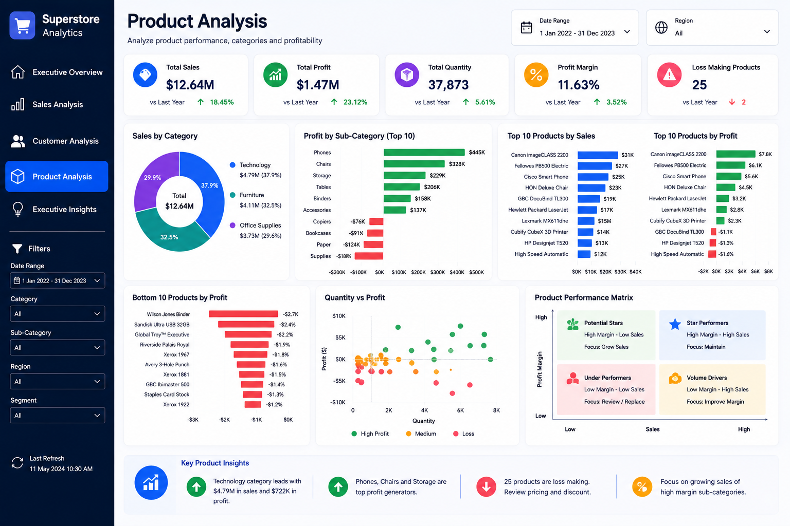
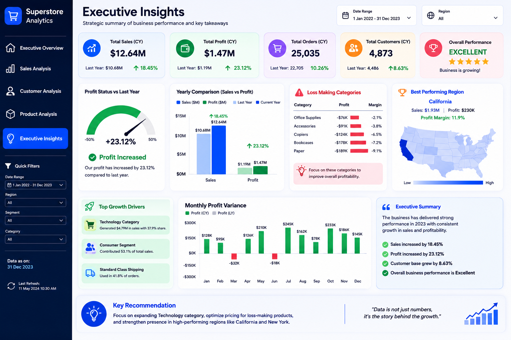

# 📊 Sales Analytics Project

An end-to-end Sales Analytics project that demonstrates the complete data analytics workflow using SQL Server, Python, and Power BI. The project covers data validation, cleaning, database design, and interactive dashboard development to generate business insights from retail sales data.

---

## Project Overview

This project follows a complete analytics pipeline, starting with raw sales data and ending with interactive Power BI dashboards. The objective is to transform transactional data into meaningful insights that help understand sales performance, customer behavior, product trends, and regional performance.

---

## Business Objective

The objective of this project is to analyze retail sales data and build an end-to-end analytics solution that converts raw transactional data into meaningful business insights.

The project focuses on understanding sales performance, customer behavior, product trends, and regional performance using SQL Server, Python, and Power BI. The final dashboard is designed to support data-driven decision making through interactive reports and key performance indicators.

---

## Dataset Information

| Metric                  | Value |

| Total Records           | 51,290 |
| Countries               | 147 |
| Customers               | 4,873 |
| Products                | 10,292 |
| Markets                 | 6 |
| Analysis Period         | 2011–2014 |
| Total Sales             | 12,642,905 |
| Total Profit            | 1,467,457.29 |
| Average Sales per Order | 246.50 |

---

## Tech Stack

- SQL Server
- Python
- Pandas
- NumPy
- Power BI
- Git
- GitHub

---

## Project Workflow



---

## Repository Structure

```text
Sales_Analytics_Project
│
├── data
│   ├── raw
│   └── cleaned
│
├── database
│   ├── 01_create_database.sql
│   └── 02_create_tables.sql
│
├── python
│   ├── 01_data_validation.py
│   ├── 02_data_cleaning.py
│   ├── 03_data_quality_report.py
│   ├── 04_load_to_sql.py
│   └── test_connection.py
│
├── powerbi
├── images
├── docs
├── README.md
├── requirements.txt
└── .gitignore
```

---

## Dashboard Preview

### Executive Overview


### Sales Analysis



### Customer Analysis



### Product Analysis



### Executive Insights



---

## Key Features

- Data validation using Python
- Data cleaning and preprocessing
- SQL Server database design
- Relational table structure with foreign keys
- Interactive Power BI dashboards
- Business KPI reporting
- End-to-end analytics workflow

---

## Getting Started

Clone the repository

```bash
git clone <your-repository-url>
```

Install the required packages

```bash
pip install -r requirements.txt
```

Run the Python scripts

```bash
python python/01_data_validation.py
python python/02_data_cleaning.py
python python/03_data_quality_report.py
python python/04_load_to_sql.py
```

## Author

**Vikash Sharma**

Aspiring Data Analyst | SQL | Python | Power BI